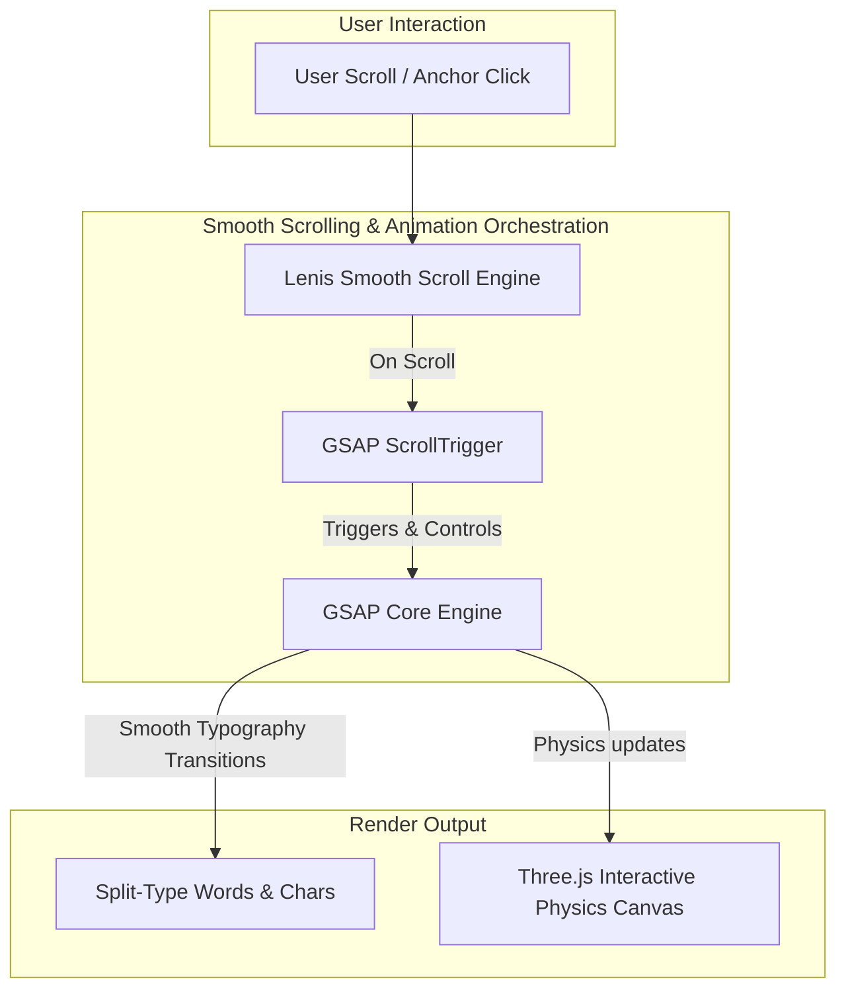

# Rahul Halkarni - Data Science & AI Portfolio Website 🚀

Welcome to the repository for my personal portfolio website, showcasing my work, projects, and experience in Data Science, Machine Learning, and AI/Prompt Engineering.

---

## 🏗️ Interactive Architecture & Flow

To deliver premium smoothness and fluid interactive performance, the scrolling, text layout, and 3D animations are orchestrated as shown below:



---

## 🛠️ Production-Ready Performance Refactoring

The original project relied on premium GSAP Club trial plugins (`ScrollSmoother` and `SplitText`) which are restricted to `localhost` and **cannot be used for production or hosting**.

To make this portfolio fully production-ready and deployable on the web, I replaced them with high-performance, open-source alternatives:

| Original Plugin | Production Alternative | Description | License |
| :--- | :--- | :--- | :--- |
| **ScrollSmoother** | **Lenis** | Standard-setting smooth scrolling with native feel and GSAP ScrollTrigger sync. | Free / MIT |
| **SplitText** | **Split-type** | Utility library to split HTML text elements into chars/words/lines for custom motion. | Free / MIT |
| **GSAP Club** | **GSAP Core** | Standard free tier of GSAP used for timing and tweens. | Free |

---

## 🚀 Quick Start & Installation

Follow these steps to run the portfolio on your local machine:

### 1. Clone the repository
```bash
git clone https://github.com/Rahullll101/Portfolio-Website.git
cd Portfolio-Website
```

### 2. Install dependencies
```bash
npm install
```

### 3. Run the development server
To run the project locally with hot reloading (adding `--force` clears Vite's pre-bundling caches):
```bash
npm run dev -- --force
```
Open `http://localhost:5173` in your browser.

### 4. Build for Production
To generate a compiled production bundle:
```bash
npm run build
```

---

## ⚙️ Tech Stack

* **Frontend:** React, TypeScript, Vite, CSS
* **Animations:** GSAP Core, GSAP ScrollTrigger, Lenis (Smooth Scroll), Split-Type
* **3D Visuals & Physics:** Three.js, React Three Fiber (R3F), Rapier Physics

---

## 📄 License & Credits

* Original layout and design by **Moncy Yohannan**.
* Customized, optimized, and developed by **Rahul Halkarni**.
* Licensed under the Personal Portfolio License (PPL) v1.0. See the `LICENSE` file for details.

